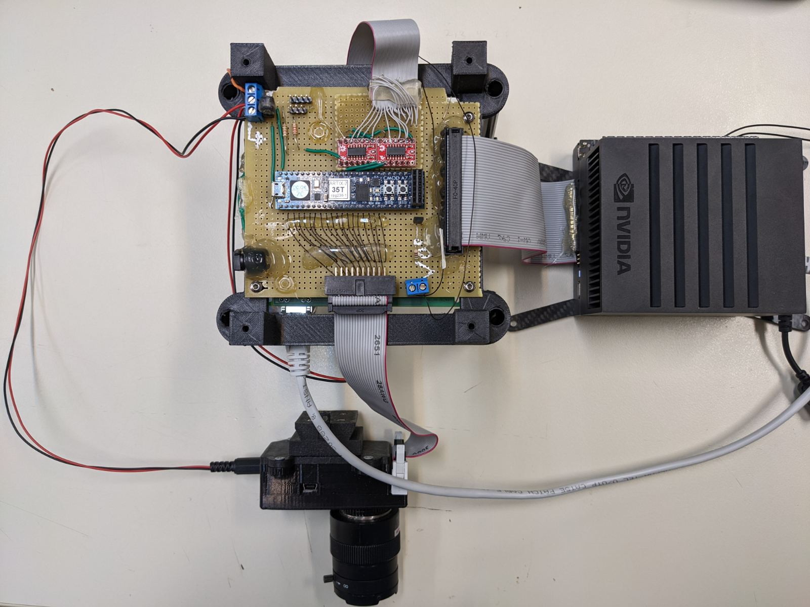

# Interfacing a DVS to SpiNN-3 Neuromorphic platform, using an FPGA.

This repository contains a VHDL design in a Cmod A7-35T FPGA development board, to interface a DVS to SpiNN-3 board. It was developed during my thesis, **Multicopter control using dynamic
vision and neuromorphic computing** that can be found in [ev_snn_percept](https://github.com/ntouev/ev_snn_percept) repository. The VLSI design procedure as well as the prototype board development are described there. If you are interested, that repo also includes the development of a framework for DVS event streams manipulation and contour-based areas real-time detection and tracking, using SpiNN-3.

